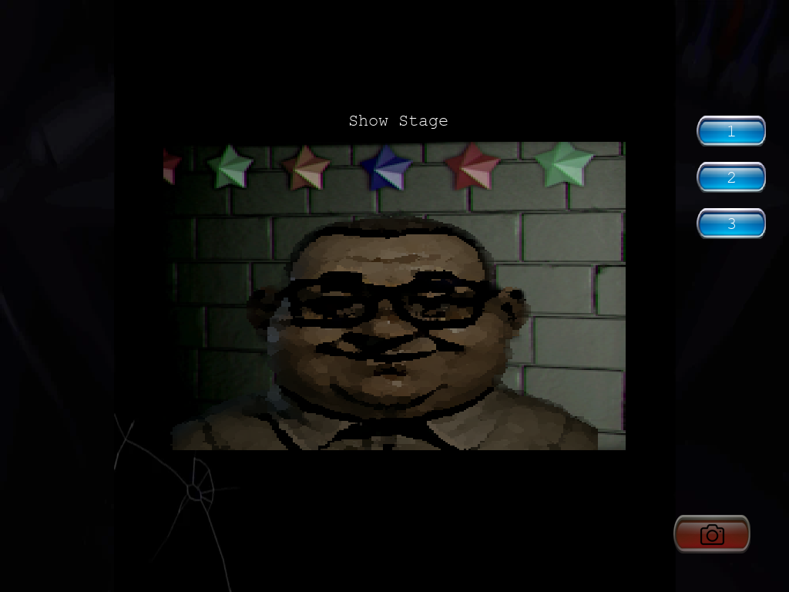
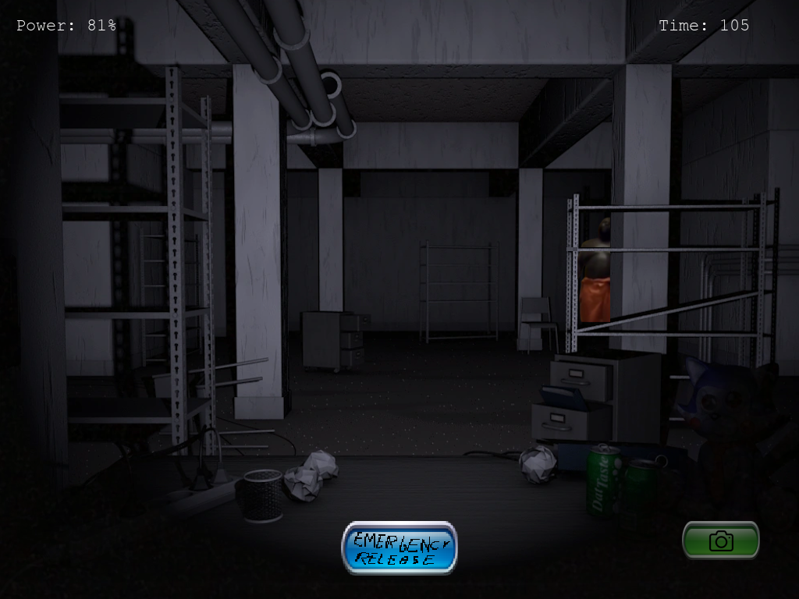

# One Night at Elektryk - FNaF Clone in Pygame

> A hilariously customizable Five Nights at Freddy’s clone made with Python & Pygame — turn your teacher into a terrifying animatronic!




## 🎮 What Is This?

**One Night at Elektryk** is a very basic Five Nights at Freddy’s-style game written in Python using Pygame. It was built with simplicity and customization in mind.  
The game is meant to be **easily modified**: just replace a few images in the `assets/` folder, and boom — you've got your own FNaF-style game featuring your teacher, boss, or even your cat.

The included version features **Dariusz Baj** — an animatronic inspired by a real-life character from the legendary halls of Elektryk.

---

## 🛠️ Features

- Basic camera-switching and office gameplay loop
- Easy image-based customization (no programming required!)
- Pure Pygame project — no installers, no bloat
- Perfect for pranks or meme games

---

## 📁 How to Customize

You can make your own version in minutes:

1. Open the `assets/` folder.
2. Replace the existing images with your own (keep the same file names).
3. Run the game and enjoy your nightmare.

---

## ▶️ Running the Game

### Requirements

- Python 3.x
- [`pygame`](https://www.pygame.org/news) (`pip install pygame`)

### Run

```bash
python main.py
```
### 📦 Download

- Just download the source code as a zip.

### 🧠 Credits

    Made by Boleklolo

    Inspired by Five Nights at Freddy’s by Scott Cawthon

    Animatronic: Dariusz Baj (in loving parody)
